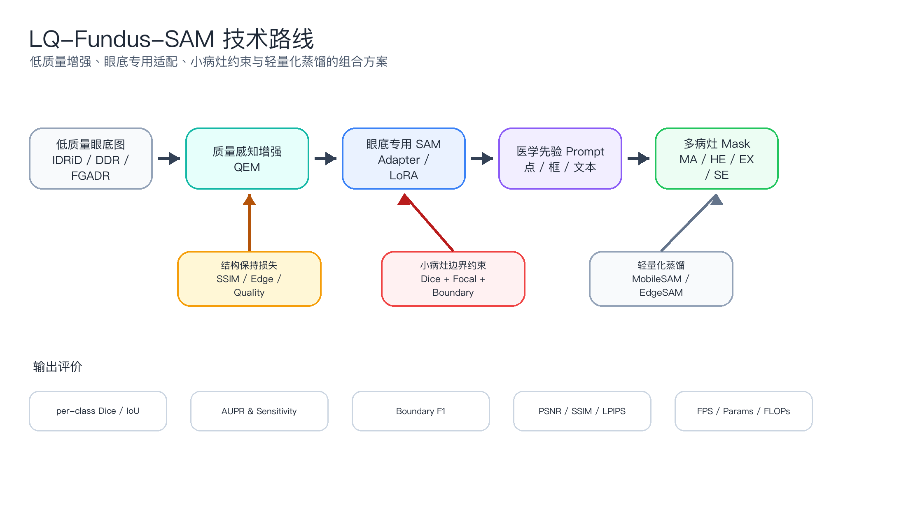
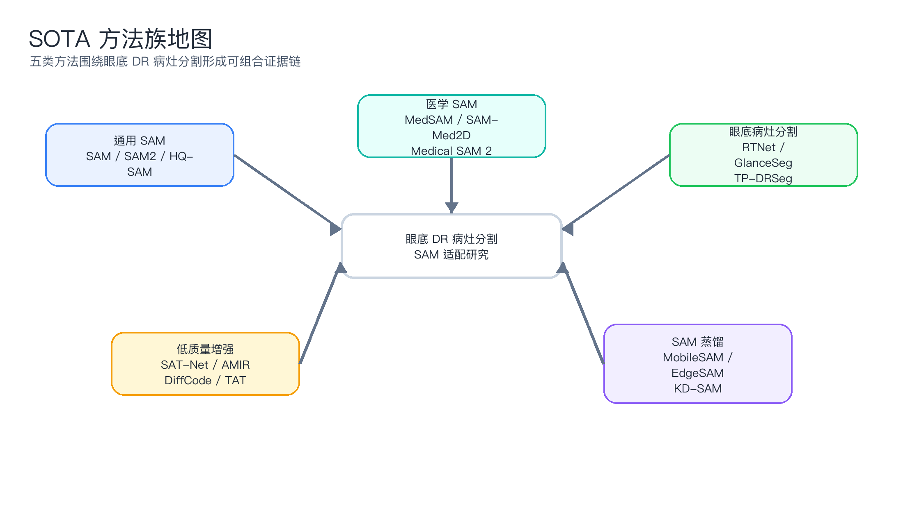
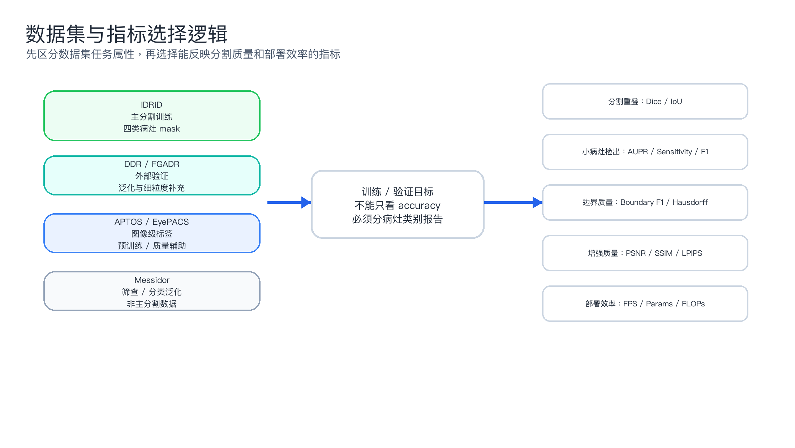
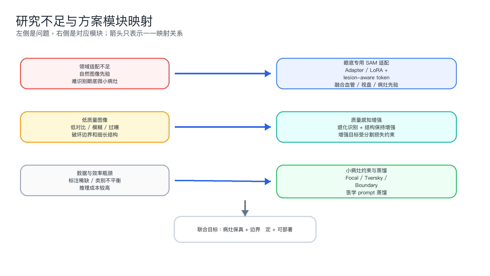
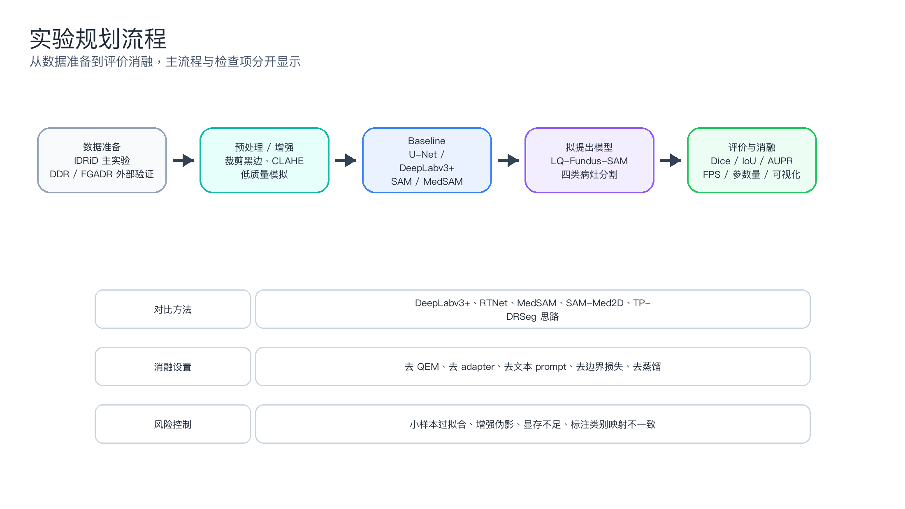

# AI开发技术-实验4.1-医学图像技术调研报告

## 题目

基于 SAM 及其医学图像适配方法的眼底视网膜病变/糖尿病视网膜病变病灶分割技术调研

## 摘要

本报告依据当前目录下 `AI技术-实验4.1-实验要求-医学图像技术调研.txt` 开展。该任务指导文件已在阶段1首先读取，并作为实验目的、实验内容、实验步骤、实验要求和交付物设计的最高优先级本地依据。围绕眼底视网膜病变/糖尿病视网膜病变病灶分割，本报告结合本地 `眼底视网膜病变分割-论文PDF` 文件夹中的 29 篇论文和 2024-2026 年外部检索文献，系统梳理 SAM、医学 SAM 适配、眼底 DR 病灶分割、低质量眼底增强与 SAM 蒸馏方向。调研发现，通用 SAM 迁移到眼底病灶分割时存在医学领域先验不足、低质量图像影响小病灶和边界、标注稀缺与推理成本较高等问题。报告提出 LQ-Fundus-SAM 方案，即低质量感知增强、眼底专用 SAM 适配、医学先验 prompt、小病灶/边界约束和轻量化蒸馏的组合框架，并给出数据集、训练设置、对比方法、评价指标、消融实验和风险备选方案。报告不编造训练结果，所有性能提升均作为待验证假设。

关键词：Segment Anything Model；MedSAM；糖尿病视网膜病变；眼底图像；病灶分割；低质量图像增强；知识蒸馏

## 1 任务依据与 AI 环境配置

本实验严格对齐任务指导文件。指导文件要求了解医学图像处理、视网膜病变分割和 SAM 技术，使用 Codex 桌面端及相关 Agent/Skill 完成调研、问题分析、解决方案、实验规划、技术报告和 PPT。工作目录为 `/mnt/c/Users/VictorTau/Desktop/hj-5`，所有结果保存在 `outputs/` 下。

运行环境优先使用 conda 环境 `hj`，命令格式为 `/home/tau/anaconda3/bin/conda run -n hj <command>`。实际检查结果为 Python 3.12.13，PyMuPDF、python-docx、python-pptx、pandas、matplotlib 均可用。过程记录见 `outputs/AI_environment_and_skill_trace.md`。

本次使用或参考的 skill 包括：academic-research-suite、nature-academic-search、nature-reader、technical-report-writer、nature-writing、nature-figure、nature-paper2ppt、presentations 和 documents。nature-academic-search 的批量搜索接口在本会话中出现事件循环错误，因此采用网页线索加单篇 arXiv/DOI 核验的降级流程，并在检索记录中如实说明。

## 2 研究背景与意义

糖尿病视网膜病变是糖尿病患者常见微血管并发症，也是可预防失明的重要原因之一。临床眼底筛查需要识别微动脉瘤、出血、硬性渗出、软性渗出等病灶。图像级 DR 分级可以提示疾病风险，但像素级病灶分割能够解释病变位置、辅助医生复核、支持病灶面积和进展量化，因此具有更强的可解释性和科研价值。

SAM 的提出使“给定提示即可分割任意对象”成为通用视觉基础模型的重要方向。MedSAM、Medical SAM Adapter、SAM-Med2D 和 Medical SAM 2 等工作进一步说明，SAM 迁移到医学图像需要医学数据、参数高效适配和 prompt 策略。眼底 DR 病灶分割恰好处于通用基础模型和专科医学应用的交汇处：一方面需要 SAM 的泛化和交互能力，另一方面又必须处理眼底图像低质量、小病灶、类别不平衡和边界模糊等细粒度问题。

## 3 本地论文库整理

本地 PDF 库共抽取 29 篇论文，类别分布为：SAM模型蒸馏 6 篇；SAM相关 9 篇；医学图像增强 5 篇；眼底视网膜病变分割 9 篇。索引脚本使用 PyMuPDF 自动读取题名、页数、arXiv/DOI、摘要/引言片段、数据集和指标线索，并按 SAM 相关、医学 SAM、眼底病变分割、医学图像增强、SAM 蒸馏等方向建立索引。完整索引见 `outputs/tables/local_paper_index.csv` 与 `outputs/tables/local_paper_index.md`。

### 3.1 本地论文方向索引摘要

| id | year | category | direction | title | arxiv | doi |
|---|---|---|---|---|---|---|
| P01 | 2023 | SAM模型蒸馏 | SAM 轻量化 / 蒸馏 | EdgeSAM: Prompt-In-the-Loop Distillation for SAM | 2312.06660 |  |
| P02 | 2023 | SAM模型蒸馏 | SAM 轻量化 / 蒸馏 | EfficientSAM | 2312.00863 |  |
| P03 | 2023 | SAM模型蒸馏 | SAM 轻量化 / 蒸馏 | MobileSAM Faster Segment Anything | 2306.14289 |  |
| P04 | 2023 | SAM模型蒸馏 | SAM 轻量化 / 蒸馏 | TinySAM | 2312.13789 |  |
| P05 | 2024 | SAM模型蒸馏 | SAM 轻量化 / 蒸馏 | SAM-Lightening | 2403.09195 |  |
| P06 | 2025 | SAM模型蒸馏 | SAM 轻量化 / 蒸馏 | KD-SAM Efficient Knowledge Distillation of SAM for Medical Image Segmentation | 2501.16740 |  |
| P07 | 2023 | SAM相关 | 通用 SAM / 高质量或快速分割 | FastSAM | 2306.12156 |  |
| P08 | 2023 | SAM相关 | 通用 SAM / 高质量或快速分割 | HQ-SAM Segment Anything in High Quality | 2306.01567 |  |
| P09 | 2023 | SAM相关 | 医学 SAM / 医学图像适配 | MedSAM Segment Anything in Medical Images | 2304.12306 |  |
| P10 | 2023 | SAM相关 | 医学 SAM / 医学图像适配 | Medical SAM Adapter | 2304.12620 |  |
| P11 | 2023 | SAM相关 | 医学 SAM / 医学图像适配 | SAM-Med2D | 2308.16184 |  |
| P12 | 2023 | SAM相关 | 医学 SAM / 医学图像适配 | Segment Anything Model for Medical Images? | 2304.14660 |  |
| P13 | 2023 | SAM相关 | 通用 SAM / 高质量或快速分割 | Segment Anything SAM | 2304.02643 |  |
| P14 | 2023 | SAM相关 | 通用 SAM / 高质量或快速分割 | Semantic-SAM | 2307.04767 |  |

### 3.2 重点论文人工分析

| ID | 论文 | 研究问题 | 方法 | 数据集/验证 | 指标 | 优势 | 不足 | 可借鉴点 |
|---|---|---|---|---|---|---|---|---|
| P13 | Segment Anything (SAM) | 如何构建可提示、可零样本迁移的通用图像分割基础模型。 | 图像编码器 + prompt encoder + 轻量 mask decoder；以点、框、mask 等 prompt 训练 promptable segmentation。 | SA-1B，约 11M 图像、1B masks；COCO/LVIS 等零样本验证。 | IoU、mIoU、zero-shot 下游任务表现。 | 统一 prompt 接口和大规模数据引擎，成为医学适配模型的基础。 | 自然图像预训练，不含眼底病灶医学先验；对低对比、小病灶、模糊边界不稳定。 | 保持 promptable 框架，将病灶候选框/点、文本或质量先验作为 prompt 融入。 |
| P09 | MedSAM | 如何把 SAM 从自然图像迁移到通用医学图像分割。 | 基于大规模医学 image-mask 对微调 SAM，采用框提示完成跨模态医学 ROI 分割。 | 1,570,263 image-mask pairs，10 类模态，86 个内部和 60 个外部验证任务。 | Dice 等医学分割指标。 | 证明大规模医学微调能显著缩小自然-医学域差距。 | 仍偏通用医学 ROI，未专门针对眼底小病灶、类别极不平衡和低质量图像。 | 作为 baseline 或 teacher，进一步做眼底专用 LoRA/adapter 微调。 |
| P10 | Medical SAM Adapter (Med-SA) | 如何用少量参数把 SAM 注入医学领域知识。 | Space-Depth Transpose + Hyper-Prompting Adapter，更新约 2% 参数。 | 17 个医学分割任务，跨多种图像模态。 | Dice、IoU、MAE 等。 | 参数高效，适合标注稀缺和算力受限课程实验。 | 不是眼底 DR 病灶专用，未显式建模病灶类别先验与图像质量。 | 在 SAM/MedSAM 的 image encoder 或 mask decoder 中加入眼底专用 adapter。 |
| P11 | SAM-Med2D | 如何系统评估并微调 SAM 于 2D 医学图像。 | 收集约 4.6M 图像、19.7M masks；比较点、框、mask prompt 与 encoder/decoder 微调策略。 | 多模态 2D 医学数据，含 fundus 类别；MICCAI 2023 challenge 外部验证。 | Dice 为主。 | 给出 prompt 类型、分辨率、微调部位对医学分割的系统证据。 | 仍是大而全医学集合，对 DR 病灶类别细粒度和低质量成像适配不足。 | 借鉴多 prompt 训练，组合病灶框/点/粗 mask 与质量标签。 |
| P23 | RTNet | 如何利用 DR 病灶之间及病灶-血管之间的病理关系改进多病灶分割。 | 双分支网络；GTB 保留小病灶细节，RTB 用自注意力建模病灶全局依赖、交叉注意力融合血管特征。 | IDRiD、DDR。 | AUC、AP/precision/recall 等。 | 显式利用眼底结构和病灶关系，贴近 DR 病理机制。 | 依赖血管伪标签；算力/内存开销和 SAM prompt 接口未统一。 | 把 vessel/lesion relation block 放入 SAM 适配头或边界约束分支。 |
| P25 | GlanceSeg | 如何在少标注条件下利用 SAM 分割微小微动脉瘤。 | 眼动 gaze map 粗定位，saliency map 生成 SAM prompt points，领域知识过滤器细化结果。 | IDRiD 与 Retinal-Lesions。 | AUPR、Precision/Recall 曲线等。 | 直接把 SAM、临床交互、微小病灶结合，是本主题最接近的本地论文之一。 | 依赖眼动数据或类似粗定位信号；主要聚焦 MA，不覆盖多病灶全类别。 | 用自动病灶候选热图/文本先验替代眼动作为 prompt 生成器。 |
| P28 | SAT-Net | 如何增强低质量眼底图像并保留血管/毛细结构。 | Transformer attention fusion、cross-quality knowledge distillation、structure-aware multi-scale loss。 | 合成与真实低质量 fundus 数据；还验证血管分割、视盘/视杯检测下游收益。 | 图像增强指标和下游任务指标。 | 把结构保持和轻量学生网络结合，正好对应低质量眼底成像问题。 | 主要目标是增强，不直接优化 DR 小病灶分割；极低分辨率/过曝仍困难。 | 作为前端质量感知增强模块，并让增强损失与分割损失联合训练。 |
| P06 | KD-SAM | 如何降低 SAM 在医学图像分割中的计算成本。 | 对 encoder 和 decoder 同时蒸馏，使用 MSE + perceptual loss 保持结构和语义特征。 | Kvasir-SEG、ISIC 2017、Fetal Head Ultrasound、Breast Ultrasound。 | Dice、参数量/复杂度等。 | 医学场景轻量化方向明确，可降低部署门槛。 | 未在眼底 DR 病灶上验证；小病灶、低质量场景下蒸馏可能丢失细节。 | 教师模型用眼底专用 SAM，学生模型用 MobileSAM/EdgeSAM，加入边界/小目标蒸馏。 |
| P01 | EdgeSAM | 如何在边缘设备上保持 SAM 交互分割能力。 | CNN student，prompt-in-the-loop distillation，把 prompt encoder/mask decoder 纳入蒸馏。 | COCO、LVIS、SA-1B 相关训练/验证。 | mIoU、FPS、FLOPs 等。 | 强调 prompt 与 mask 生成动态关系，比单纯 encoder 蒸馏更适合交互式分割。 | 自然图像蒸馏，非医学；未关注眼底小病灶。 | 用于眼底模型轻量化：让学生学习质量增强后图像、prompt 和高质量 mask 的联合行为。 |

## 4 在线检索与最新进展

阶段4围绕 2024-2026 年 SAM 医学图像分割、眼底病灶分割、低质量眼底增强和轻量化/蒸馏 SAM 检索。关键外部结果包括 TP-DRSeg、Medical SAM 2、MedSAM2、KD-SAM、SAT-Net、AMIR、DiffCode 和 2025 年医学分割 generalist model 综述。完整检索式、来源、日期和筛选理由见 `outputs/notes/literature_search_record.md`。

| 检索日期 | 检索式 | 来源 | 文献 | 年份 | 标识/链接 | 筛选理由 |
|---|---|---|---|---|---|---|
| 2026-05-29 | Segment Anything Model medical image segmentation 2025 MedSAM2 SAM-Med2D | arXiv via nature-academic-search get_paper_by_id | MedSAM2: Segment Anything in 3D Medical Images and Videos | 2025 | arXiv:2504.03600 | SAM2 到 3D/视频医学分割的最新医学适配，说明 promptable 医学基础模型仍在向更大数据和人机协同扩展。 |
| 2026-05-29 | Medical SAM 2 Segment medical images as video via Segment Anything Model 2 | arXiv via nature-academic-search get_paper_by_id | Medical SAM 2: Segment medical images as video via Segment Anything Model 2 | 2024 | arXiv:2408.00874 | 把 2D/3D 医学图像当作视频跟踪问题处理，启发连续眼底随访或多图一 prompt 策略。 |
| 2026-05-29 | TP-DRSeg explicit text prompt diabetic retinopathy lesion segmentation SAM | arXiv via nature-academic-search get_paper_by_id | TP-DRSeg: Improving Diabetic Retinopathy Lesion Segmentation with Explicit Text-Prompts Assisted SAM | 2024 | arXiv:2406.15764 | 最贴近本课题：显式文本/医学概念提示辅助 SAM 做 DR 病灶分割，可作为方案中文本先验模块依据。 |
| 2026-05-29 | Generalist Models in Medical Image Segmentation survey 2025 SAM | arXiv via nature-academic-search get_paper_by_id | Generalist Models in Medical Image Segmentation: A Survey and Performance Comparison with Task-Specific Approaches | 2025 | arXiv:2506.10825 | 2025 综述，覆盖 SAM、SAM2、adapter、fine-tuning、zero/few-shot 与任务专用模型对比。 |
| 2026-05-29 | knowledge distillation SAM medical image segmentation 2025 | arXiv via nature-academic-search get_paper_by_id | Efficient Knowledge Distillation of SAM for Medical Image Segmentation | 2025 | arXiv:2501.16740 | 医学 SAM 蒸馏，支持研究方案中的轻量化/部署模块。 |
| 2026-05-29 | low quality retinal fundus image enhancement 2025 transformer SAT-Net | CrossRef via nature-academic-search get_paper_by_id | SAT-Net: Structure-Aware Transformer-Based Attention Fusion Network for Low-Quality Retinal Fundus Images Enhancement | 2025 | DOI:10.1109/TMM.2025.3565935 | 低质量眼底增强与结构保持，正对任务指导文件建议问题 b。 |
| 2026-05-29 | All-In-One Medical Image Restoration task-adaptive routing 2024 | arXiv via nature-academic-search get_paper_by_id | All-In-One Medical Image Restoration via Task-Adaptive Routing | 2024 | arXiv:2405.19769 | 多退化医学图像统一恢复，启发低质量类型识别和 task routing。 |
| 2026-05-29 | All-in-One Medical Image Restoration diffusion codebook 2025 | arXiv via nature-academic-search get_paper_by_id | DiffCode: All-in-One Medical Image Restoration with Latent Diffusion-Enhanced VQ Codebook Prior | 2025 | arXiv:2507.19874 | 任务自适应高质量先验和 diffusion retrieval 可作为低质量增强替代路线。 |
| 2026-05-29 | MedSAM3 Segment Anything with medical concepts 2025 | arXiv via nature-academic-search get_paper_by_id | MedSAM3: Delving into Segment Anything with Medical Concepts | 2025 | arXiv:2511.19046 | 医学概念/文本提示是 SAM 适配新趋势；因日期晚于当前日期，报告中标注为未来待跟踪预印本，不作为已发表结论。 |

## 5 国内外研究现状与 SOTA 方法分析

现有研究可归纳为五个方法族：通用 SAM、医学 SAM 适配、眼底 DR 病灶分割、低质量医学/眼底增强和 SAM 蒸馏/轻量化。通用 SAM 提供基础分割范式；医学 SAM 适配解决自然-医学域差距；眼底专用模型强调病灶-血管关系和小病灶检测；低质量增强改善可见性；蒸馏方向降低部署成本。

| 方向 | 代表方法 | 核心思想 | 适合本课题的价值 | 主要局限 |
|---|---|---|---|---|
| 通用分割基础模型 | SAM / SAM2 | promptable segmentation；SAM2 引入 streaming memory 支持图像/视频。 | 提供可提示的基础 mask 生成器和交互式分割范式。 | 自然图像域；对低质量眼底和微小病灶需领域适配。 |
| 医学 SAM 适配 | MedSAM、Medical SAM Adapter、SAM-Med2D、Medical SAM 2、MedSAM2 | 医学数据微调、adapter/LoRA、prompt 策略、SAM2 医学跟踪化。 | 说明从自然到医学必须注入医学域知识。 | 多为通用医学目标，尚未充分解决 DR 小病灶和低质量问题。 |
| 眼底 DR 病灶分割 | HEDNet+cGAN、RTNet、GlanceSeg、LANet、DeepLabv3+、TP-DRSeg | 边缘/对抗损失、病灶-血管关系、小病灶注意力、gaze/saliency prompt、文本先验。 | 提供 DR 专用结构和类别先验，可与 SAM 结合。 | 标注少、类别极不平衡；有些方法只针对 MA 或不够轻量。 |
| 低质量医学/眼底增强 | SAT-Net、AMIR、DiffCode、TAT、MedSR-Vision | 结构感知增强、任务自适应路由、扩散/VQ 先验、超分与质量评估。 | 可改善模糊、低对比、过曝导致的病灶边界不清。 | 增强指标不一定等同于分割收益；可能改变病灶纹理需联合约束。 |
| SAM 蒸馏/轻量化 | MobileSAM、EfficientSAM、TinySAM、EdgeSAM、SAM-Lightening、KD-SAM | 轻量 encoder、masked image pretraining、prompt-in-loop distillation、Flash Attention、医学蒸馏。 | 降低推理成本，适合筛查/边缘部署。 | 轻量化可能损失微小病灶细节，需要小目标/边界蒸馏约束。 |

## 6 常用数据集与评价指标

数据集需要区分像素级病灶分割数据和图像级 DR 分级数据。IDRiD、DDR、FGADR 更适合病灶分割；APTOS、EyePACS、Messidor 更适合图像级分类、预训练、质量评估或外部筛查泛化讨论。评价指标不能只看 accuracy，应同时报告 per-class Dice/IoU、AUPR、Sensitivity、Specificity、F1、Boundary F1，以及增强和效率指标。

### 6.1 数据集对比

| 数据集 | 任务属性 | 规模/标注 | 适用性 | 注意事项 |
|---|---|---|---|---|
| IDRiD | DR 分级、病灶分割、视盘/中央凹定位 | 常用描述为 516 张眼底图，包含 MA、HE、EX、SE 像素级标注；训练/测试划分需按官方协议确认。 | 本课题首选分割数据集，覆盖四类典型 DR 病灶。 | 样本量小且类别不平衡，MA/SE 等小目标评估波动大。 |
| DDR | DR 检测、分级与病灶分割 | 公开资料常描述为 13,673 张眼底图，其中部分图像含像素级病灶标注。 | 适合外部验证和跨数据集泛化评估。 | 不同子集标注密度不同，需区分 classification 与 segmentation split。 |
| FGADR | 细粒度 DR 标注 | 常用描述为 1,842 张图像，提供多类别病灶/等级相关标注。 | 适合补充小病灶和细粒度病灶分析。 | 公开可得性和标注类别映射需在实验前核验。 |
| APTOS 2019 | DR 分级/分类 | Kaggle 竞赛数据，常用训练集约 3,662 张图像，标签为 0-4 级。 | 可用于预训练质量/病灶感知分类辅助，不适合作为像素级分割主数据。 | 无官方病灶分割 mask。 |
| EyePACS | DR 分级/筛查 | Kaggle/EyePACS 大规模眼底图像，常用于 DR classification。 | 可用于自监督预训练、质量评估或分类辅助。 | 主要是图像级标签，不是病灶分割数据集。 |
| Messidor / Messidor-2 | DR 分级、筛查评估 | Messidor 常用描述为 1,200 张彩色眼底图；Messidor-2 为更大筛查数据。 | 适合外部筛查/分类验证或图像质量/泛化分析。 | 通常无像素级 DR 病灶 mask，不能直接训练病灶分割。 |

### 6.2 指标对比

| 指标 | 定义/含义 | 适用场景 | 注意事项 |
|---|---|---|---|
| Dice | 2\|P∩G\|/(\|P\|+\|G\|)，衡量 mask 重叠；医学分割常用。 | 病灶/血管/器官分割 | 小病灶下对少量像素误差极敏感。 |
| IoU/Jaccard | \|P∩G\|/\|P∪G\|，重叠区域占并集比例。 | 通用分割、SAM 评估 | 比 Dice 更严格。 |
| AUC | ROC 曲线下面积，衡量阈值无关分类/检测能力。 | DR 筛查、病灶像素/图像级检测 | 类别极不平衡时应补充 AUPR。 |
| Sensitivity/Recall | TP/(TP+FN)，衡量漏检控制能力。 | 筛查、小病灶召回 | 本课题应优先关注 MA/HE 小病灶召回。 |
| Specificity | TN/(TN+FP)，衡量假阳性控制能力。 | 临床筛查/分类 | 需要与 sensitivity 同时报出。 |
| Precision/F1 | Precision=TP/(TP+FP)，F1=2PR/(P+R)。 | 病灶检测/分割二值化结果 | 病灶很稀疏时 F1/AUPR 比 accuracy 更有意义。 |
| AUPR/AP | Precision-Recall 曲线面积或平均精度。 | 微动脉瘤、出血等稀疏病灶 | 比 AUC 更能反映正类稀少场景。 |
| PSNR/SSIM/LPIPS | 图像增强/超分常用保真、结构相似和感知质量指标。 | 低质量眼底增强 | 需同时报告下游分割指标，避免“增强好看但分割变差”。 |
| FPS/参数量/FLOPs | 推理效率与模型复杂度。 | SAM 蒸馏/部署 | 应在固定输入大小、硬件和 batch 设置下比较。 |

## 7 研究不足分析

第一，SAM 从通用图像迁移到眼底 DR 病灶分割时领域适配不足。SAM 训练源主要是自然图像，缺少眼底血管、视盘、病灶形态和 DR 类别先验。MedSAM、Medical SAM Adapter 和 SAM-Med2D 证明医学微调有效，但通用医学 ROI 与 DR 小病灶之间仍有差距。TP-DRSeg 的出现进一步说明，DR 病灶分割需要显式医学概念和文本提示。

第二，低质量眼底图像会导致微小病灶、边界和细长结构分割不稳定。真实筛查图像常见模糊、低对比、过曝、低分辨率和伪影。SAT-Net 表明结构感知增强可改善眼底图像质量并保留血管细节，但增强指标本身不能保证病灶分割提升，因此增强模块应与分割目标联合约束。

第三，标注稀缺、类别不平衡、小病灶漏检和推理成本高共同限制实际应用。像素级 DR 数据集规模较小，背景像素占比极高，MA/SE 等小目标容易被整体 Dice 掩盖。SAM/MedSAM 推理成本高，若需要人工点/框 prompt，也会增加临床工作流负担。

## 8 研究方案设计

本报告提出 LQ-Fundus-SAM：低质量感知增强 + 眼底专用 SAM 适配 + 小病灶/边界约束 + 轻量化蒸馏的组合方案。目标是在 IDRiD、DDR 等数据上提升 DR 多病灶分割效果，特别关注 MA/HE 小病灶召回、边界质量、低质量图像鲁棒性和推理效率。

方案包含五个模块：质量感知增强模块 QEM、眼底专用 SAM 适配模块 FSA、医学先验 prompt 模块 MPP、小病灶/边界约束模块 SBC、轻量化蒸馏模块 LSD。Baseline 建议包括 U-Net、DeepLabv3+、HEDNet+cGAN、RTNet、SAM zero-shot、MedSAM、SAM-Med2D、Medical SAM Adapter，以及 GlanceSeg/TP-DRSeg 思路。

总损失函数可设计为：`L = L_seg + λ1 L_boundary + λ2 L_small + λ3 L_quality + λ4 L_distill`。其中 `L_seg` 为 Dice + Focal/Tversky，`L_boundary` 为边界或 Hausdorff 约束，`L_small` 为小病灶重加权或 lesion-level recall，`L_quality` 保持增强图的结构与病灶纹理，`L_distill` 用于大模型到轻量学生的 embedding/mask/边界蒸馏。

## 9 实验规划

实验以 IDRiD 为主数据集，DDR 和 FGADR 用于外部验证或联合训练，APTOS/EyePACS/Messidor 用于预训练、质量评估或筛查泛化讨论。预处理包括眼底圆形视野裁剪、黑边去除、分辨率归一化、颜色标准化、低质量模拟和小病灶增强。训练设置建议冻结 SAM 主干，训练 adapter、prompt 生成器、mask head 和增强模块；若显存有限，优先使用 512×512 输入、梯度累积和轻量学生模型。

消融实验包括去掉 QEM、去掉 adapter、去掉文本/类别 prompt、去掉结构先验、去掉小病灶损失和去掉蒸馏。可视化应展示原图、增强图、ground truth、baseline 和拟提出模型预测，并单独分析低质量样本、小病灶样本和边界复杂样本。完整实验规划见 `outputs/notes/experiment_plan.md`。

## 10 AI 过程记录与 Agent/Skill 调用

本次实验按照 academic-research-suite 的阶段化研究思路完成任务拆解；使用 nature-reader 的源文件定位与结构化阅读思想处理本地重点论文；使用 nature-academic-search 对 arXiv/DOI 进行单篇核验；使用 technical-report-writer 建立合规矩阵和证据映射；使用 nature-figure 生成技术路线图、问题-方案图、实验流程图等；使用 documents 和 presentations 生成 Word 报告与 PPTX。详细轨迹见 `outputs/AI_environment_and_skill_trace.md`。

## 11 心得体会

本次实验最大的收获是把“读论文”从线性摘要变成了可追溯的工程化过程：先依据任务指导文件明确交付物，再把本地 PDF、在线检索、SOTA 方法、数据集、指标、问题和方案逐层组织。SAM 类基础模型很强，但医学场景不能简单套用；眼底 DR 病灶分割尤其需要尊重小病灶、低质量成像和临床可解释性。另一个体会是，AI 工具的价值不只是生成文字，而是帮助建立索引、合规矩阵、证据链、方案蓝图和可提交文档。对不确定信息必须标注，不能为了让报告“好看”而编造实验结果。

## 12 结论

围绕 SAM 医学图像适配和眼底 DR 病灶分割，本报告完成了本地论文库整理、重点论文阅读、在线文献核验、SOTA/数据集/指标总结、问题分析、研究方案和实验规划。结论是：未来可行方向不是单独改一个模型，而是将低质量增强、眼底领域适配、医学概念 prompt、小病灶/边界损失和轻量化蒸馏结合，形成面向真实筛查场景的端到端方案。

## 参考文献

1. Kirillov A, Mintun E, Ravi N, et al. Segment Anything. arXiv:2304.02643, 2023.
2. Ma J, He Y, Li F, et al. Segment Anything in Medical Images. arXiv:2304.12306, 2023.
3. Wu J, Ji W, Liu Y, et al. Medical SAM Adapter: Adapting Segment Anything Model for Medical Image Segmentation. arXiv:2304.12620, 2023.
4. Cheng J, Ye J, Deng Z, et al. SAM-Med2D. arXiv:2308.16184, 2023.
5. Ravi N, Gabeur V, Hu Y T, et al. SAM 2: Segment Anything in Images and Videos. arXiv:2408.00714, 2024.
6. Li W, Xiong X, Xia P, Ju L, Ge Z. TP-DRSeg: Improving Diabetic Retinopathy Lesion Segmentation with Explicit Text-Prompts Assisted SAM. arXiv:2406.15764, 2024.
7. Huang S, Li J, Xiao Y, Shen N, Xu T. RTNet: Relation Transformer Network for Diabetic Retinopathy Multi-lesion Segmentation. arXiv:2201.11037, 2022.
8. Jiang H, Gao M, Liu Z, et al. GlanceSeg: Real-time microaneurysm lesion segmentation with gaze-map-guided foundation model for early detection of diabetic retinopathy. arXiv:2311.08075, 2023.
9. Xiao Q, et al. Improving Lesion Segmentation for Diabetic Retinopathy using Adversarial Learning. arXiv:2007.13854, 2020.
10. Xia X, Zhan K, Fang Y, Jiang W, Shen F. Lesion-aware network for diabetic retinopathy diagnosis. International Journal of Imaging Systems and Technology, DOI:10.1002/ima.22933.
11. Wen Y, Luo B, Shi W, et al. SAT-Net: Structure-Aware Transformer-Based Attention Fusion Network for Low-Quality Retinal Fundus Images Enhancement. IEEE Transactions on Multimedia, DOI:10.1109/TMM.2025.3565935.
12. Patil K D, Palani G, Krishnamurthi G. Efficient Knowledge Distillation of SAM for Medical Image Segmentation. arXiv:2501.16740, 2025.
13. Zhou C, Li X, Loy C C, Dai B. EdgeSAM: Prompt-In-the-Loop Distillation for SAM. arXiv:2312.06660, 2023.
14. Moglia A, Leccardi M, Cavicchioli M, et al. Generalist Models in Medical Image Segmentation: A Survey and Performance Comparison with Task-Specific Approaches. arXiv:2506.10825, 2025.
15. Dai L, Wu L, Li H, et al. A deep learning system for detecting diabetic retinopathy across the disease spectrum. Nature Communications, DOI:10.1038/s41467-021-23458-5.
16. Dai L, Sheng B, Chen T, et al. A deep learning system for predicting time to progression of diabetic retinopathy. Nature Medicine, DOI:10.1038/s41591-023-02702-z.
17. Li J, Guan Z, Wang J, et al. Integrated image-based deep learning and language models for primary diabetes care. Nature Medicine, DOI:10.1038/s41591-024-03139-8.
